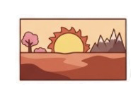
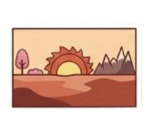
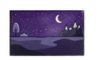

<!-- БАННЕР -->

  

  <h1 style="color: white; font-size: 2.8rem; font-weight: normal; margin: 0; text-shadow: 0 2px 12px rgba(0,0,0,0.8); position:relative; z-index:1;">
    Марсианская энциклопедия
  </h1>
  

    Свободный справочник о мире «Письмо из Красной пыли»
  

# Марсианская энциклопедия

**Марсианская энциклопедия** — научно-художественный справочный проект, посвящённый вселенной цикла романов **«Письмо из Красной пыли»** (автор — **Mnemis**). В основе проекта лежит реконструкция возможной истории Марса, выполненная с опорой на актуальные научные данные из областей геологии, климатологии, астробиологии и физики планет.

Материалы энциклопедии не являются чистым вымыслом. Они представляют собой **научно обоснованную гипотетическую модель** — экстраполяцию того, какой могла бы быть жизнь на Марсе, если бы она действительно существовала в его древнюю эпоху. Все гипотезы, представленные в проекте, находятся в рамках современных научных представлений и не противоречат известным фактам о Красной планете. Они не могут быть ни подтверждены, ни опровергнуты на текущем уровне развития науки, что оставляет пространство для размышлений и альтернативных интерпретаций.

Источниковедческая база энциклопедии строится на трёх уровнях:

1. **Реальные научные данные** — геологическая история Марса, климатические изменения, наличие жидкой воды в прошлом, обнаружение органических молекул, перхлоратов и метана в атмосфере.
2. **Художественная концепция** — расшифровка глиняных табличек, найденных историком **[Хевсуром](people/hevsur.md)** в подземном храме долины Ксанфа, описывающих историю марсианской цивилизации в Эпоху Умирания.
3. **Логическая реконструкция** — моделирование биологических, социальных и культурных процессов, которые могли бы иметь место в условиях низкой гравитации (0,38 g), разрежённой атмосферы и постепенного угасания планеты.

    <!-- Левая колонка -->
    

<!-- ============ СЕКЦИЯ: Избранная статья ============ -->

##  Избранная статья

### Хевсур — последний хранитель глины

**[Хевсур](people/hevsur.md)** (2685 – ок. 2745 гг. Э.О.) — марсианский историк, писец и хранитель архива Академии Окхасена. Центральный персонаж эпопеи «Письмо из Красной пыли», посвятивший свою жизнь сбору, систематизации и сохранению знаний о гибнущем Марсе. Его главное наследие — «глиняная библиотека» — собрание тысяч табличек, которые пережили гибель планеты и легли в основу марсианской энциклопедии. В отличие от [Талина](people/talin.md), который улетел к Земле, Хевсур выбрал остаться на Марсе, чтобы записать его последние дни.
[Читать полную статью о Хевсуре →](people/hevsur.md)

<!-- ============ СЕКЦИЯ: Знаете ли вы? ============ -->

##  Знаете ли вы?

-  **Талин** — главный астронавигатор Марса, впервые увидел Землю в телескоп в 2714 году. Его расчёты траектории стали основой для Исхода к Земле[^1].
-  **Ацидалийское море** — реально существующая равнина на Марсе, которая в книгах является крупнейшим водоёмом и символом уходящей жизни. В 2735 году море замёрзло впервые за тысячи лет[^2].
-  **Марсианская письменность** — лого-силлабическая, содержит более 200 знаков. Она была создана в 890 году Э.О. и использовалась для записи всех знаний на глиняных табличках[^3].
-  Слово **«Lān sur»** в переводе означает **«Глина помнит»**. Это сакральная фраза, которая стала девизом писцов и хранителей памяти на протяжении всей марсианской истории[^4].

<!-- ============ СЕКЦИЯ: О цикле книг ============ -->

##  О цикле книг «Письмо из Красной пыли»

**«Письмо из Красной пыли»** — цикл романов в жанре твёрдой научной фантастики и планетарной драмы, созданный автором **Mnemis**. Действие происходит на Марсе в последние десятилетия перед гибелью планеты — в Эпоху Умирания. Цикл объединяет научную достоверность с глубокими философскими размышлениями о памяти, надежде и цене выживания.

### Вышедшие книги

| Название | Год | Краткое описание |
|----------|-----|------------------|
| **[«Ацидалийское море»](books/acidalia-sea.md)** | 2026 | Первый роман. Знакомит с миром Эпохи Умирания и жизнью в Окхасене |

<!-- ============ СЕКЦИЯ: О проекте ============ -->

##  О проекте

Проект адресован широкой аудитории, интересующейся вопросами происхождения жизни во Вселенной, эволюции планет и возможных форм разума за пределами Земли. Марсианская энциклопедия предлагает читателю не готовые ответы, а пространство для размышлений — модели того, какой могла бы быть история Марса, если бы на нём действительно существовала жизнь.

Все гипотезы, представленные в проекте, основаны на реальных научных данных и не противоречат современному знанию. По вопросам сотрудничества и уточнения материалов: mnemis.author@mail.ru.

<!-- ============ СЕКЦИЯ: Интерактивные элементы ============ -->

##  Интерактивные элементы

###  Случайная статья

  <button id="randomArticleBtn" style="
    background: #0645ad;
    color: white;
    border: none;
    padding: 12px 24px;
    font-size: 1.2rem;
    font-family: 'Georgia', serif;
    border-radius: 4px;
    cursor: pointer;
    box-shadow: 0 2px 6px rgba(0,0,0,0.2);
  ">
     Случайная статья
  </button>

<!-- ============ ПРАВАЯ КОЛОНКА ============ -->

<!-- ============ СЕКЦИЯ: Марсианский календарь ============ -->

###  Марсианский календарь

  
Загрузка...

<!-- ============ СЕКЦИЯ: В этот день на Марсе ============ -->

###  В этот день на Марсе

  

    
    загрузка...
  

  
загрузка...

  

<!-- ============ СЕКЦИЯ: Изображение дня ============ -->

###  Изображение дня

  

     Изображение дня
  

  

    
загрузка...

  

  

  

<!-- ============ СЕКЦИЯ: Цитата дня ============ -->

###  Цитата дня

  Загрузка...

<!-- ============ СЕКЦИЯ: Спутники Марса ============ -->

###  Спутники Марса

  

     Спутники Марса
  

  

    
       Фобос:
    
    загрузка...
  

  

    
       Деймос:
    
    загрузка...
  

  

    

    

  

  

    Данные: NASA Horizons (28 июня 2026, 14:34 UT)
  

<!-- ============ СЕКЦИЯ: Звук ветра на Марсе ============ -->

###  Звук ветра на Марсе

  <button id="windSoundBtn" style="
    background: #0645ad;
    color: white;
    border: none;
    padding: 10px 24px;
    font-size: 1rem;
    font-family: 'Georgia', serif;
    border-radius: 4px;
    cursor: pointer;
    box-shadow: 0 2px 6px rgba(0,0,0,0.2);
  ">
     Включить звук ветра
  </button>

<audio id="windAudio" loop preload="auto">
  <source src="assets/sounds/mars-wind.mp3" type="audio/mpeg">
</audio>

  

## Примечания

<references />
[^1]: Талин впервые увидел Землю в 2714 году. Это событие описано в «Ацидалийском море» как ключевой момент, определивший судьбу марсианской цивилизации.
[^2]: Ацидалийское море — реальная равнина на Марсе, существующая и сегодня. В книгах она является крупнейшим водоёмом Марса в Эпоху Умирания.
[^3]: Марсианская письменность появилась в 890 году Э.О. Она была лого-силлабической и использовалась для записи всех знаний на глиняных табличках.
[^4]: «Lān sur» — сакральная фраза, означающая «Глина помнит». Она стала девизом писцов и хранителей памяти.
