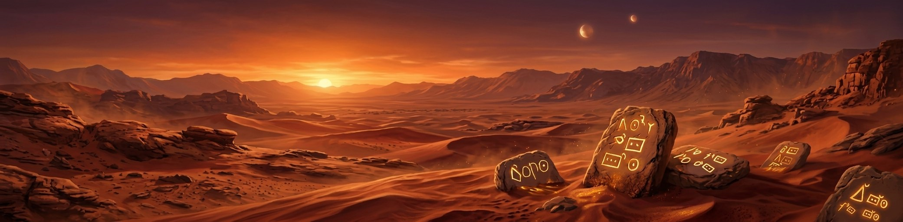
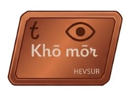
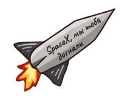
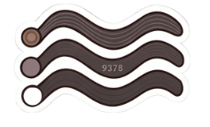
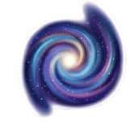
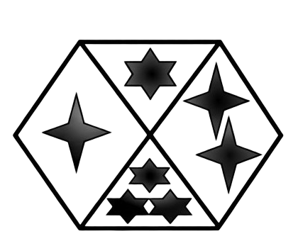
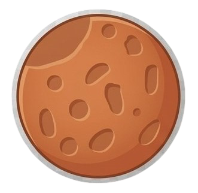
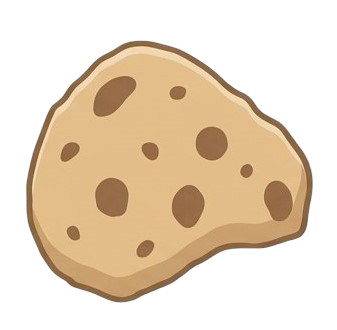
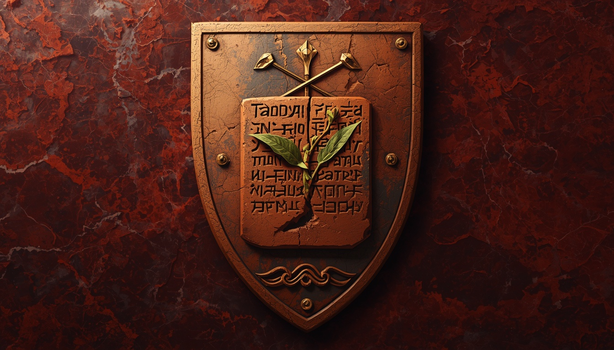

<link rel="preload" as="image" href="assets/images/header-banner.png" fetchpriority="high">
<link rel="preconnect" href="https://raw.githubusercontent.com" crossorigin>

  
  

  

    <h1>Марсианская энциклопедия</h1>
    
Свободный справочник о мире «Письмо из Красной пыли»

  

# Марсианская энциклопедия

**Марсианская энциклопедия** — научно-художественный справочный проект, посвящённый вселенной цикла романов **«Письмо из Красной пыли»** (автор — **Mnemis**). В основе проекта лежит реконструкция возможной истории Марса, выполненная с опорой на актуальные научные данные из областей геологии, климатологии, астробиологии и физики планет.

Материалы энциклопедии не являются чистым вымыслом. Они представляют собой **научно обоснованную гипотетическую модель** — экстраполяцию того, какой могла бы быть жизнь на Марсе, если бы она действительно существовала в его древнюю эпоху. Все гипотезы, представленные в проекте, находятся в рамках современных научных представлений и не противоречат известным фактам о Красной планете. Они не могут быть ни подтверждены, ни опровергнуты на текущем уровне развития науки, что оставляет пространство для размышлений и альтернативных интерпретаций.

Источниковедческая база энциклопедии строится на трёх уровнях:

1. **Реальные научные данные** — геологическая история Марса, климатические изменения, наличие жидкой воды в прошлом, обнаружение органических молекул, перхлоратов и метана в атмосфере.
2. **Художественная концепция** — расшифровка глиняных табличек, найденных историком **[Хевсуром](people/hevsur.md)** в подземном храме долины Ксанфа, описывающих историю марсианской цивилизации в Эпоху Умирания.
3. **Логическая реконструкция** — моделирование биологических, социальных и культурных процессов, которые могли бы иметь место в условиях низкой гравитации (0,38 g), разрежённой атмосферы и постепенного угасания планеты.

<h3> Избранная статья</h3>

<h4>Хевсур — последний хранитель глины</h4>

<strong><a href="people/hevsur.md">Хевсур</a></strong> (2685 – ок. 2745 гг. Э.О.) — марсианский историк, писец и хранитель архива Академии Окхасена. Центральный персонаж эпопеи «Письмо из Красной пыли», посвятивший свою жизнь сбору, систематизации и сохранению знаний о гибнущем Марсе. Его главное наследие — «глиняная библиотека» — собрание тысяч табличек, которые пережили гибель планеты и легли в основу марсианской энциклопедии. В отличие от <a href="people/talin.md">Талина</a>, который улетел к Земле, Хевсур выбрал остаться на Марсе, чтобы записать его последние дни.

<a href="people/hevsur.md">Читать полную статью о Хевсуре →</a>

<h3> Знаете ли вы?</h3>

<ul>
<li> <strong>Талин</strong> — главный астронавигатор Марса, впервые увидел Землю в телескоп в 2714 году. Его расчёты траектории стали основой для Исхода к Земле.</li>
<li> <strong>Ацидалийское море</strong> — реально существующая равнина на Марсе, которая в книгах является крупнейшим водоёмом и символом уходящей жизни. В 2735 году море замёрзло впервые за тысячи лет.</li>
<li> <strong>Марсианская письменность</strong> — лого-силлабическая, содержит более 200 знаков. Она была создана в 890 году Э.О. и использовалась для записи всех знаний на глиняных табличках.</li>
<li> Слово <strong>«Lān sur»</strong> в переводе означает <strong>«Глина помнит»</strong>. Это сакральная фраза, которая стала девизом писцов и хранителей памяти на протяжении всей марсианской истории.</li>
</ul>

<h3> О цикле книг «Письмо из Красной пыли»</h3>

<strong>«Письмо из Красной пыли»</strong> — цикл романов в жанре твёрдой научной фантастики и планетарной драмы, созданный автором <strong>Mnemis</strong>. Действие происходит на Марсе в последние десятилетия перед гибелью планеты — в Эпоху Умирания. Цикл объединяет научную достоверность с глубокими философскими размышлениями о памяти, надежде и цене выживания.

<h4>Вышедшие книги</h4>

<table>
<thead>
<tr><th>Название</th><th>Год</th><th>Краткое описание</th></tr>
</thead>
<tbody>
<tr><td><strong><a href="books/acidalia-sea.md">«Ацидалийское море»</a></strong></td><td>2026</td><td>Первый роман. Знакомит с миром Эпохи Умирания и жизнью в Окхасене</td></tr>
</tbody>
</table>

<h3> О проекте</h3>

Проект адресован широкой аудитории, интересующейся вопросами происхождения жизни во Вселенной, эволюции планет и возможных форм разума за пределами Земли. Марсианская энциклопедия предлагает читателю не готовые ответы, а пространство для размышлений — модели того, какой могла бы быть история Марса, если бы на нём действительно существовала жизнь.

Все гипотезы, представленные в проекте, основаны на реальных научных данных и не противоречат современному знанию. По вопросам сотрудничества и уточнения материалов: mnemis.author@mail.ru.

<h3> Интерактивные элементы</h3>

<h4> Случайная статья</h4>

  <button id="randomArticleBtn" class="vip-btn">🎲 Случайная статья</button>

<h4> Марсианский календарь</h4>

  
Загрузка...

<h4> В этот день на Марсе</h4>

  

    
    загрузка...
  

  
загрузка...

  

<h4> Изображение дня</h4>

  

    
загрузка...

  

  

  

<h4> Цитата дня</h4>

  Загрузка...

<h4> Спутники Марса</h4>

  

     Фобос:
   загрузка...

  

     Деймос:
   загрузка...

  

    

    

  

  

    Данные: NASA Horizons (28 июня 2026, 14:34 UT)
  

<h3> Избранные списки</h3>

  

    
    
Герб династии королей Эдема

  

  

    
Последний избранный

    
<a href="lists/eden-kings/">Список королей Эдема</a>

  

  

    
    
Герб династии Ксанфид

  

  

    
Предыдущий

    
<a href="lists/ksanf-pirates/">Пиратские короли Ксанфа</a>

  

  <a href="lists/" style="font-size:.9rem;">Все избранные списки →</a>

<h4> Звук ветра на Марсе</h4>

  <button id="windSoundBtn" class="vip-btn">🎵 Включить звук ветра</button>

<audio id="windAudio" loop preload="none">
  <source src="assets/sounds/mars-wind.mp3" type="audio/mpeg">
</audio>

