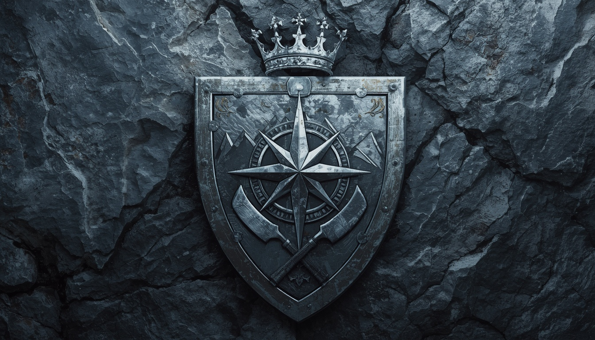
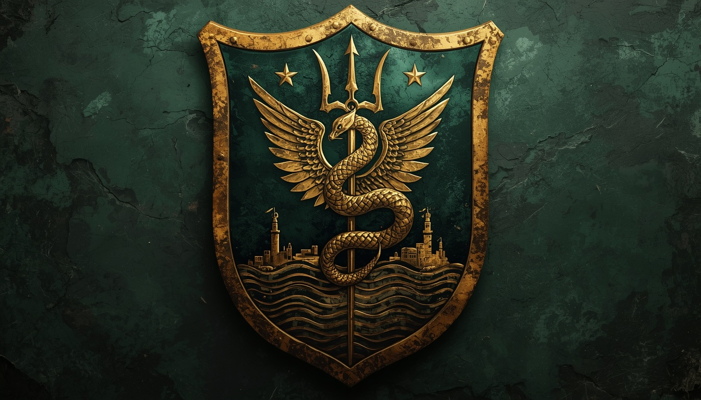
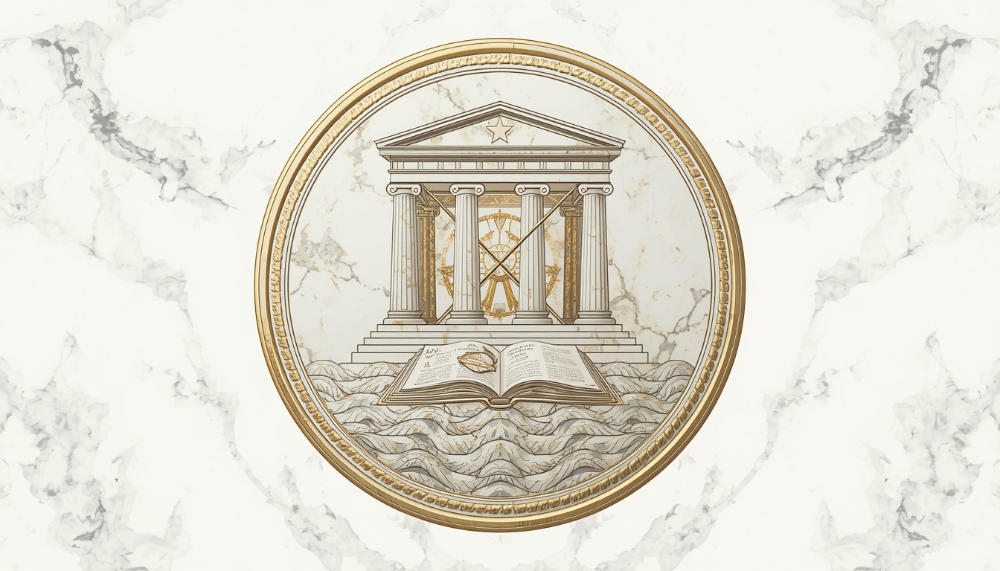
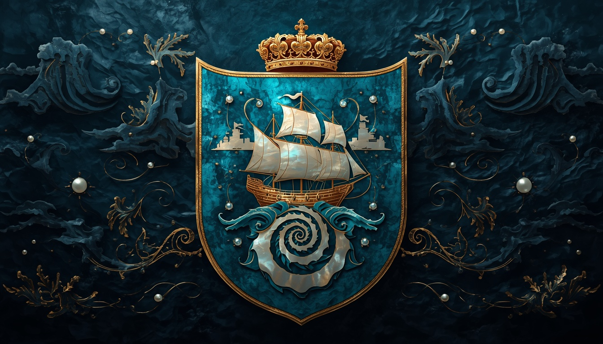
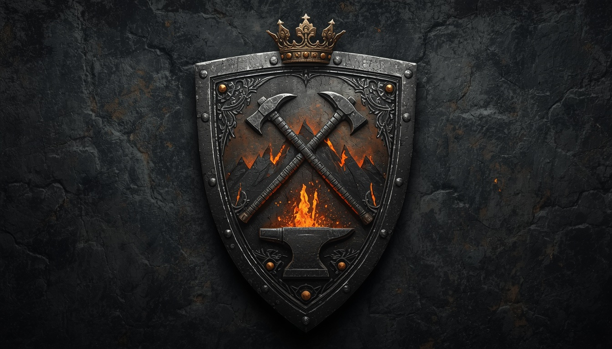
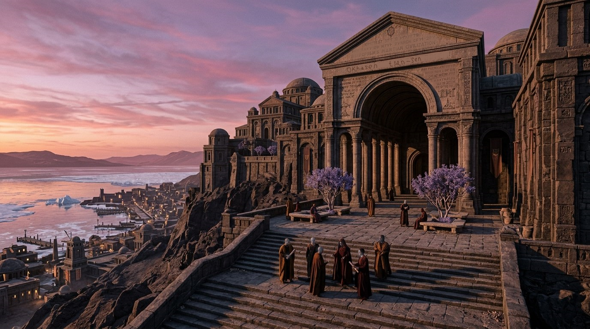

# Избранные списки и порталы

**Избранные списки** — это списки, которые редакторы Марсианской энциклопедии считают лучшими в проекте. Перед тем как появиться на этой странице, они проходят процедуру обсуждения на предмет точности, полноты, нейтральности и стиля изложения.

На настоящий момент в энциклопедии **{n}** избранных списков.

---

## Все избранные списки

<!-- Короли Эдема -->

  
  
Герб династии Сарумидов

  
<a href="eden-kings/"><strong>Список королей Эдема</strong></a>

<!-- Держатели ветра Аркадии -->

  
  
Герб династии Терманидов

  
<a href="arkadia-princes/"><strong>Список Держателей ветра</strong></a>

<!-- Короли Серпентиды -->

  
  
Герб династии Серпендидов

  
<a href="serpentida-kings/"><strong>Короли Серпентиды</strong></a>

<!-- Правители Эллады -->

  
  
Герб династии Элладидов

  
<a href="hellas-rulers/"><strong>Правители Эллады</strong></a>

<!-- Пиратские короли Ксанфа -->

  
  
Герб династии Ксанфидов

  
<a href="ksanf-pirates/"><strong>Пиратские короли Ксанфа</strong></a>

<!-- Адмиралы Утопии -->

  
  
Герб династии Угидов

  
<a href="utopia-admirals/"><strong>Адмиралы Утопии</strong></a>

<!-- Мастера Кхонга -->

  
  
Герб династии Харитидов

  
<a href="khong-masters/"><strong>Мастера Кхонга</strong></a>

<!-- Великие писцы Академии -->

  
  
Академия Окхасена

  
<a href="great-scribes/"><strong>Великие писцы Академии</strong></a>

---

## Как стать избранным списком?

Чтобы список получил статус избранного, он должен соответствовать следующим критериям:

- **Полнота** — список охватывает все значимые элементы по теме.
- **Точность** — все факты подтверждены источниками.
- **Нейтральность** — изложение без субъективных оценок.
- **Структура** — есть введение, критерии включения и логичная группировка.
- **Оформление** — единый стиль, аккуратные таблицы и иллюстрации.
